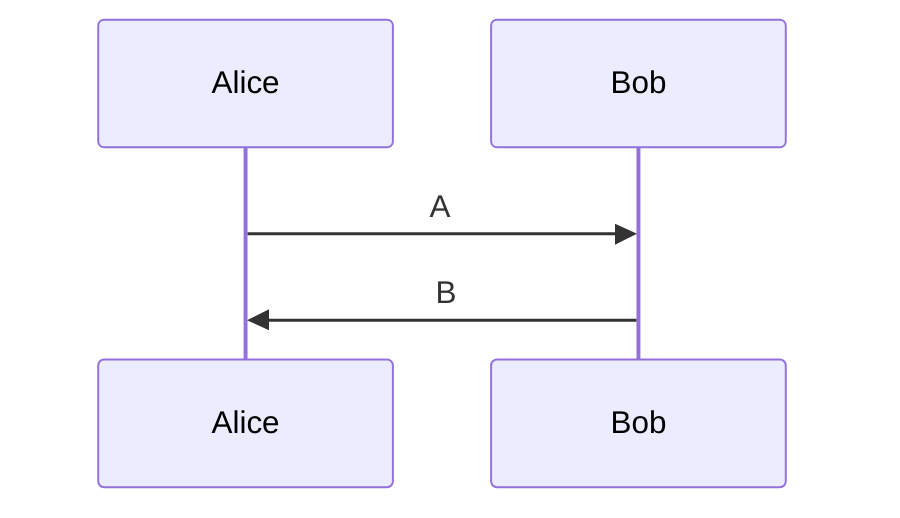

[TextFragment](./vocab.xml#L4:~:text=<Function%20Name="-,TextFragment,-")


Note the included UML diagrams $m, m+1, \ldots, m+n-1$.



Left|Right
----|-----
DrillState|Possible drill states are: <dl><dt>`expanded` <dd>if an entry precedes entries from deeper aggregation levels <dt>`collapsed` <dd>if an entry belongs to the highest non-expanded aggregation level, but not the deepest <dt>`leaf` <dd>if an entry belongs to the deepest aggregation level</dl>

```objectivec
@weakify(self);
[self.bannerAdUnit fetchDemandWithAdObject:gamRequest completion:^(enum ResultCode resultCode)        { 
  @strongify(self);
}];
```

    ```xml
    <block>
      <of>
        <code />
      </of>
    </block>
    ```