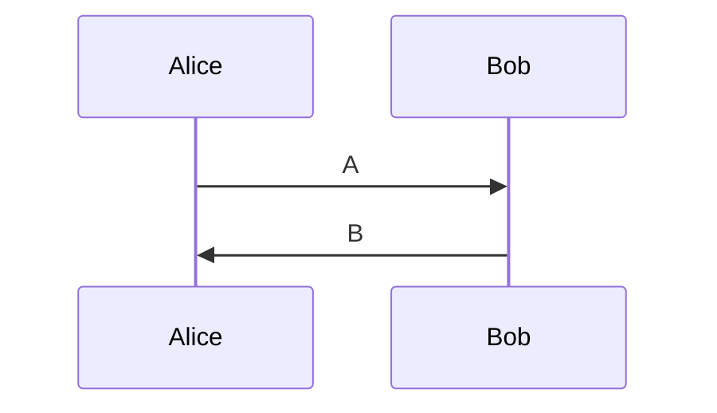

[TextFragment](./vocab.xml#L4:~:text=<Function%20Name="-,TextFragment,-")

Note the included UML diagrams $m, m+1, \ldots, m+n-1$.

```mermaid
sequenceDiagram
  Alice ->> Bob: A
  Bob ->> Alice: B
```
