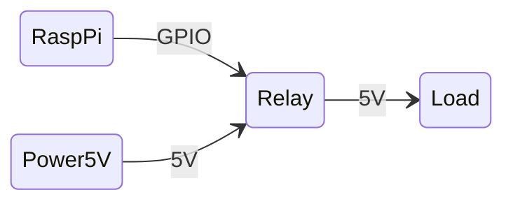

```mermaid
---
config:
  themeCSS: |
    #edge1, #edge2 { stroke: red; stroke-width: 2px; }
---
stateDiagram
  direction LR
  RaspPi --> Relay :GPIO
  Power5V --> Relay: 5V
  Relay --> Load: 5V
```

```geojson
{"type": "FeatureCollection",
 "features": [{
   "type": "Feature",
   "bbox": [8.6, 49.2, 8.7, 49.4]
 }]}
```
